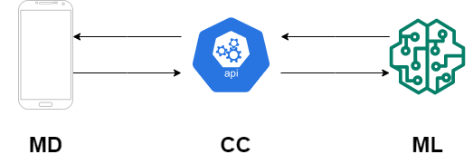
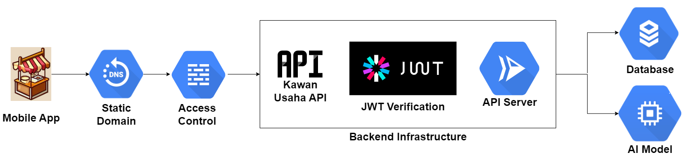

# Readme.md

# Kawan-Usaha-API

This repository hosts our API for the application Kawan Usaha. As the CC team, we made this API to serve and manage various data such as articles and users but also to connect between the MD side to the ML side. After MD sends the conversation, we can forward it to the model. After that, we will also forward the answers we got from the model to the application.

## Our Cloud Computing Team:

- Gabrielle Evan Farrel (C151DSX2011)
- Muhammad Kholif Alami (C151DSX1941)

## The Cloud Infrastructure



Before we start, I’ll explain the purpose of the Kawan-Usaha API. It’s used to manage and serve all the backend needs of the application. It also is used as a proxy to access the AI model for the chatbot function.




The picture above is our cloud infrastructure. The mobile app accesses the API through a static domain provided to refer to our API. The API is hosted on Cloud Run for easy CI/CD (Continous Integration/Continous Deployment) and the ability to stream messages. The API uses Cloud SQL with PostgreSQL for database and it can access the compute engine where the model is being hosted for inference.


Default API Message (Without JWT)

## Prerequisites

Kawan-Usaha API Repository

Google Cloud Platforn with enough permissions (Cloud Run Admin, Network Admin, Compute Engine Admin, Cloud SQL Admin)

Enough credits for all the resources

## Infrastructure Deployment

### Cloud SQL Deployment

1. Open navigation menu and go to SQL
1. Create new PostgreSQL instance with this following configurations:
    - Region: as needed
    - Single Zone (cheaper)
    - Machine Type: Standard 1vCPU 3.75 GB
    - Storage: SSD 20GB
    - Network: Default, Public IP, Private IP.
1. Connect to the instance and create new user and database.
1. Database is ready to use.

### Cloud Storage Deployment

1. Open navigation menu and go to Cloud Storage.
1. Create a new bucket with this following configurations.
    - Bucket name: needs to be unique.
    - Availability: single region (cheap) multi region (high availability).
    - Class: Standard.
    - ACL: Fine grained, uncheck the enforce public access.
    - Protection: None, or retention policy
1. After the bucket is created, click on the name.
1. Go to PERMISSIONS tab, and grant access to AllUsers the permission “Storage Object Viewer” to make it publicly readable.

### Creating a service account key

1. Open the navigation menu, and go to IAM & Admin
1. Go to Service Accounts on the Sidebar
1. Either use an existing service account or create a new one to access the cloud SQL and cloud Storage
1. Click on the name of the service account of your choosing
1. Go to the KEYS tab
1. Press the ADD KEY button and create a new JSON key
1. Save that key to be used in deploying the API later
1. Go back to IAM to grant permissions for the service account
1. Give the service account these permissions:
    - Cloud SQL Editor
    - Storage Object Creator

### API Deployment

####

Cloud Run Deployment

1. Clone repository to local machine with
git clone https://github.com/Kawan-Usaha/Kawan-Usaha-API.git
1. Move your Service Account Key to the directory.
1. Copy the .env.example file to .env
1. Fill out the necessary variables inside the environment
1. Use this following command:

```bash
gcloud run deploy kawan-usaha-cloud-run \
        --allow-unauthenticated \
        --service-account=service@account:you.used \
        --timeout=600 \
        --max-instances=5 \
        --set-cloudsql-instances=sql-instance-name:you:have-made \
        --binary-authorization default \
        --region=your-region \
        --source .
```

6. The application is now deployed on your project.

Cloud Domain

1. Go to deployed Cloud Run service
1. Go to the information button near the URL
1. Go to Manage Custom Domains
1. Click Register Domain
1. Pick the domain you want, and pay it.
1. Map the service to the domain

Cloud VPC - Firewall

1. Go to VPC Network - Firewall
1. Create a new firewall rule
1. Create a rule that allows TCP:8000 for the ML API
1. Confirm

## Commit History

Commit history is available on https://github.com/Kawan-Usaha/Kawan-Usaha-API/commits/main.

